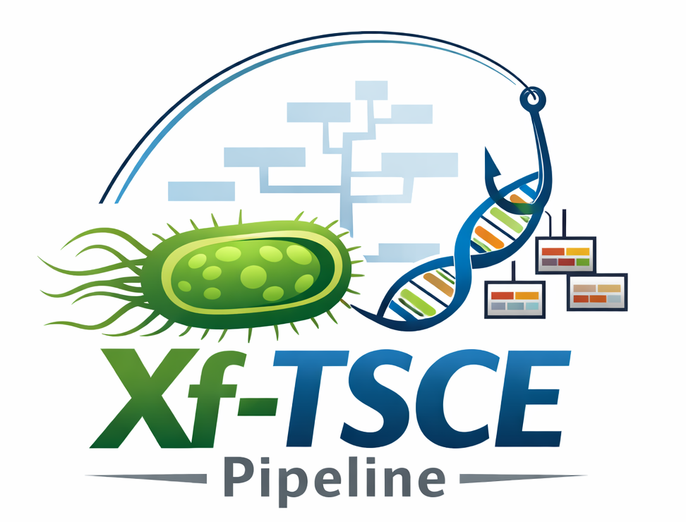

# XfCapture


<table>
  <tr>
    <td style="width:66%; vertical-align:middle; font-size:1.1em;">
      A scalable Snakemake pipeline for analyzing <i>Xylella fastidiosa</i> targeted sequence capture enrichment (<b>Xf</b>-TSCE) sequencing data, featuring automated quality control, targeted gene reconstruction, MLST typing, and phylogenetic analysis.
    </td>
    <td style="width:33%; text-align:center; vertical-align:middle;">
      
    </td>
  </tr>
</table>

[](https://opensource.org/licenses/MIT)
[](https://snakemake.readthedocs.io/en/stable/)
[](https://www.python.org/)
[](https://github.com/Luisagi/XfCapture)

---

## Table of Contents

- [Quick Start](#quick-start)
- [Installation](#installation)
- [Input Requirements](#input-requirements)
- [Output Structure](#output-structure)
- [Configuration](#configuration)
- [Usage](#usage)
- [Citation](#citation)
- [References](#references)
- [Authors and Contributors](#authors-and-contributors)
- [License](#license)


---

## Quick Start

### Step 1: System and software requirements

Before installing, ensure your system meets these requirements:

- **Operating System**: Linux or macOS
- **RAM**: Minimum 32 GB (64+ GB recommended for large datasets)
- **CPU**: Multi-core system (16+ cores recommended)
- **Disk Space**: ~8-16 GB for databases + storage for your data

The following software must be installed:

- [Snakemake](https://snakemake.readthedocs.io/) ≥ 9.5.1
- [Python](https://www.python.org/) ≥ 3.11 and ≤ 3.12
- [Conda](https://docs.conda.io/en/latest/) or [Mamba](https://github.com/mamba-org/mamba)

```bash
# optional, if not installed already
conda create -c conda-forge -c bioconda -n xfcapture snakemake=>9.0 python=>3.11

# activate environment
conda activate xfcapture
```
### Step 2: Installation

```bash
# Clone this repository
git clone https://github.com/Luisagi/XfCapture.git
cd XfCapture/

# Install package
pip install -e .

# Verify installation
xf_capture --help
```

---

## Input Requirements

### File Structure

Organize your FASTQ files in a single directory:

```bash
input_fastq_dir/
├── sample1_R1.fastq.gz
├── sample1_R2.fastq.gz
├── sample2_R1.fastq.gz
└── sample2_R2.fastq.gz
```

### Supported Naming Formats

The pipeline automatically recognizes multiple naming conventions:

| Format | Example | Sample Name |
|--------|---------|-------------|
| Standard | `ABC123_R1.fastq.gz` | ABC123 |
| CASAVA | `ABC123_S1_L001_R1_001.fastq.gz` | ABC123 |
| Simple | `ABC123_1.fastq.gz` | ABC123 |

**Supported extensions**: `.fastq`, `.fq`, `.fastq.gz`, `.fq.gz`

**Important**: Sample names cannot contain: `_*#@%^/! ?&:;|<>`

---

## Output Structure

The XfCapture pipeline is organized into two main phases. The first phase focuses on processing each sample individually, including quality control, taxonomic classification, target gene reconstruction, and MLST typing. The second phase performs comparative analysis between samples, generating alignments and phylogenetic trees only for those samples that successfully passed the previous steps.

Each output directory corresponds to a key analysis stage:

- **01.pre-processing/**: Contains quality control reports and FASTQ files processed by fastp.
- **02.tax-classification/**: Includes taxonomic classification results from Kraken2 and Recentrifuge.
- **03.probes_reconstruction/**: Stores reconstructed gene sequences for each sample, along with reconstruction statistics.
- **04.mlst-typing/**: Presents MLST typing results, both individual and summary files.
- **05.phylogenetic_trees/**: Holds alignments, phylogenetic trees, and their visualizations generated from successfully reconstructed samples.

```bash
output_dir/
├── 01.pre-processing/           # fastp QC reports and trimmed reads
│   ├── sample1.fastp.html
│   └── sample1.fastp.json
├── 02.tax-classification/       # Kraken2 and Recentrifuge results
│   ├── sample1.kraken2.report
│   └── sample1.html
├── 03.probes_reconstruction/    # Reconstructed gene sequences
│   ├── sample1.consensus.fasta
│   └── sample1.stats.txt
├── 04.mlst-typing/              # MLST typing results
│   ├── sample1.mlst.tsv
│   └── mlst_summary.tsv
└── 05.phylogenetic_trees/       # Phylogenetic analysis
    ├── alignment.fasta
    ├── tree.newick
    └── tree.pdf
```

---

## Usage

### 1. Set up the working directory

First, create a working directory where the pipeline will store all required references, probe files, and the Kraken2 database. You can choose any location for this directory.

Depending on your system RAM, you can use either the 8 GB or 16 GB Kraken2 database. By default, the lighter 8 GB version is downloaded, but the 16 GB version is recommended if your system has at least 64 GB RAM.

```bash
# Set up directories and config (choose 16Gb or 8Gb for the database)
xf_capture setup --dir /path/to/xf_capture_db --k2-db "16Gb"
```

This command creates the following structure:

```
/path/to/xf_capture_db/
├── conda_envs/
├── databases/
│   └── kraken2/
│       ├── k2_pluspfp_16_GB
│       └── k2_pluspfp_08_GB
├── reference_seqs/
│   ├── probes.fasta
│   └── xf_genomes/
└── xf_capture_config.yaml
```

**Notes:**

- You can manually download any Kraken2 database and place it in `databases/kraken2/`. 
See [kraken2 AWS indexes](https://benlangmead.github.io/aws-indexes/k2). 
- To include additional *Xf* [genomes](https://www.ncbi.nlm.nih.gov/datasets/genome/?taxon=2371) in the phylogenetic analysis, add their FASTA (`.fna`) files to `reference_seqs/xf_genomes/`. No special naming is required, but avoid special characters in filenames.

### 2. Run the pipeline


---

## References

### Core Tools

- **Snakemake**:  
  Mölder, F., Jablonski, K. P., Letcher, B., Hall, M. B., Tomkins-Tinch, C. H., Sochat, V., Forster, J., Lee, S., Twardziok, S. O., Kanitz, A., Wilm, A., Holtgrewe, M., Rahmann, S., Nahnsen, S., & Köster, J. (2021). Sustainable data analysis with Snakemake. *F1000Research*, 10, 33.

- **fastp**:  
  Chen, S., Zhou, Y., Chen, Y., & Gu, J. (2018). fastp: An ultra-fast all-in-one FASTQ preprocessor. *Bioinformatics*, 34(17), i884–i890.

- **Kraken2**:  
  Wood, D. E., Lu, J., & Langmead, B. (2019). Improved metagenomic analysis with Kraken 2. *Genome Biology*, 20(1), 257.  
  Lu, J., Rincon, N., Wood, D. E., Breitwieser, F. P., Pockrandt, C., Langmead, B., ... & Steinegger, M. (2022). Metagenome analysis using the Kraken software suite. *Nature Protocols*, 17(12), 2815-2839.

- **Recentrifuge**:  
  Martí, J. M. (2019). Recentrifuge: Robust comparative analysis and contamination removal for metagenomics. *PLOS Computational Biology*, 15(4), e1006967.

- **BWA**:  
  Li, H., & Durbin, R. (2009). Fast and accurate short read alignment with Burrows–Wheeler transform. *Bioinformatics*, 25(14), 1754-1760.

- **Samtools & BCFtools**:  
  Danecek, P., Bonfield, J. K., Liddle, J., Marshall, J., Ohan, V., Pollard, M. O., Whitwham, A., Keane, T., McCarthy, S. A., Davies, R. M., & Li, H. (2021). Twelve years of SAMtools and BCFtools. *GigaScience*, 10(2), giab008.

- **BLAST+**:  
  Camacho, C., Coulouris, G., Avagyan, V., Ma, N., Papadopoulos, J., Bealer, K., & Madden, T. L. (2009). BLAST+: Architecture and applications. *BMC Bioinformatics*, 10, 421.

- **SeqKit**:  
  Shen, W., Le, S., Li, Y., & Hu, F. (2016). SeqKit: a cross-platform and ultrafast toolkit for FASTA/Q file manipulation. *PloS one*, 11(10), e0163962.

- **MLST**:  
  Seemann T., mlst  Github https://github.com/tseemann/mlst  
  Jolley, K. A., & Maiden, M. C. (2010). BIGSdb: scalable analysis of bacterial genome variation at the population level. *BMC bioinformatics*, 11(1), 595.

- **MAFFT**:  
  Katoh, K., & Standley, D. M. (2013). MAFFT multiple sequence alignment software version 7: improvements in performance and usability. *Molecular Biology and Evolution*, 30(4), 772–780.

- **IQ-TREE**:  
  Minh, B. Q., Schmidt, H. A., Chernomor, O., Schrempf, D., Woodhams, M. D., Von Haeseler, A., & Lanfear, R. (2020). IQ-TREE 2: new models and efficient methods for phylogenetic inference in the genomic era. *Molecular Biology and Evolution*, 37(5), 1530-1534.  
  Chernomor, O., Von Haeseler, A., & Minh, B. Q. (2016). Terrace aware data structure for phylogenomic inference from supermatrices. *Systematic Biology*, 65, 997-1008.  
  Minh, B. Q., Nguyen, M. A. T., & Von Haeseler, A. (2013). Ultrafast approximation for phylogenetic bootstrap. *Molecular Biology and Evolution*, 30(5), 1188–1195.

- **R packages**:  
  R Core Team (2025). R: A Language and Environment for Statistical Computing. R Foundation for Statistical Computing, Vienna, Austria. https://www.R-project.org/  
  Revell, L. J. (2024). phytools 2.0: an updated R ecosystem for phylogenetic comparative methods (and other things). *PeerJ*, 12, e16505.  
  Paradis, E., & Schliep, K. (2019). ape 5.0: an environment for modern phylogenetics and evolutionary analyses in R. *Bioinformatics*, 35(3), 526-528.  
  Yu, G., Smith, D. K., Zhu, H., Guan, Y., & Lam, T. T. Y. (2017). ggtree: an R package for visualization and annotation of phylogenetic trees with their covariates and other associated data. *Methods in ecology and evolution*, 8(1), 28-36.

---

### Contact

For questions, suggestions, or collaboration:
- Open an [issue](https://github.com/Luisagi/XfCapture/issues)

---

## License

This project is licensed under the MIT License - see the [LICENSE](LICENSE) file for details.

---

## Acknowledgments

This work was funded by the European Union's Horizon Europe research and innovation programme under **BeXyl Grant Agreement 101060593**.

We thank:
- The *Xylella fastidiosa* research community
- The Snakemake development team
- All developers of the bioinformatics tools integrated in this pipeline

---

<p align="center">
  <sub>Made with ❤️ for the <i>Xylella fastidiosa</i> research community</sub>

