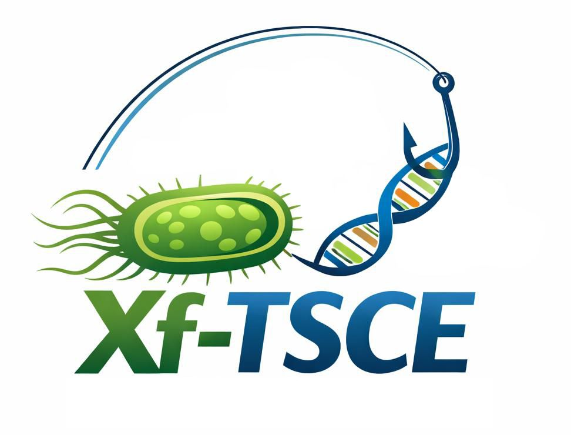
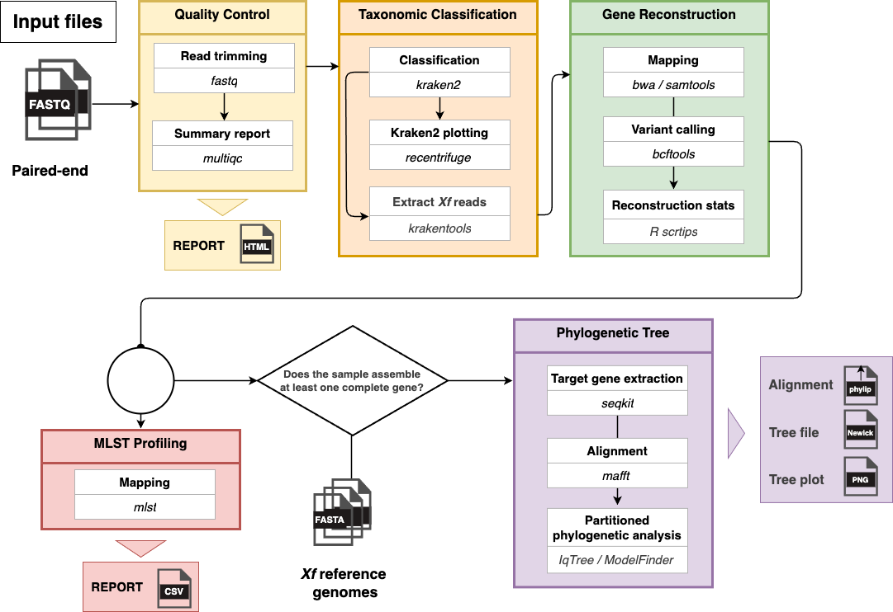

# XfCapture (beta-version)


[](https://opensource.org/licenses/MIT)
[](https://snakemake.readthedocs.io/en/stable/)
[](https://www.python.org/)
[](https://github.com/Luisagi/XfCapture)


</a>

<hr>

> A scalable Snakemake pipeline for end-to-end analysis of  *Xylella fastidiosa* **T**argeted **S**equence **C**apture **E**nrichment (*Xf*-TSCE) Illumina sequencing data, from raw FASTQ files to phylogenetic inference.


## Pipeline summary


<div align="center">
  
</div>


## Table of Contents

- [Quick Start](#quick-start)
- [Installation](#installation)
- [Usage](#usage)
- [Multi-Sample Joint Phylogeny](#multi-sample-joint-phylogeny)
- [Input Requirements](#input-requirements)
- [Output Structure](#output-structure)
- [Configuration](#configuration)
- [Troubleshooting](#troubleshooting)
- [References](#references)
- [Authors and Contributors](#authors-and-contributors)
- [License](#license)

---

## Quick Start

### Step 1: System and Software Requirements

| Requirement | Minimum | Recommended |
|-------------|---------|-------------|
| **OS** | Linux or macOS | - |
| **RAM** | 24 GB | 64+ GB |
| **CPU** | Multi-core | 16+ cores |
| **Disk Space** | ~8-16 GB (databases) + data storage | - |

**Required Software:**

- [Python](https://www.python.org/) ≥ 3.11
- [Conda](https://docs.conda.io/en/latest/) or [Mamba](https://github.com/mamba-org/mamba)
- [Snakemake](https://snakemake.readthedocs.io/) ≥ 9.0

**Create a Conda environment with Snakemake:**

```bash
conda create -c conda-forge -c bioconda -n xfcapture snakemake
conda activate xfcapture
```

> **⚠️ IMPORTANT: Conda Channel Configuration**  
> Configure conda channels **before** installation to ensure reproducible dependency resolution:

```bash
conda config --add channels defaults
conda config --add channels bioconda
conda config --add channels conda-forge
conda config --set channel_priority strict
```


### Step 2: Installation

**Three-command setup:**

```bash
# 1. Install XfCapture
git clone https://github.com/Luisagi/XfCapture.git
cd XfCapture
pip install -e .

# 2. Prepare references and databases
xf_capture setup --dir /path/to/xf_capture_db --k2-db "16GB"

# 3. Run the pipeline
xf_capture run -i test_data/ -o results/ --cores 16
```

**Available commands:**

```bash
xf_capture setup       # Prepare resources (references, databases, configs)
xf_capture run         # Run the pipeline
xf_capture multi-phylo # Build a joint tree from a selected subset of samples
xf_capture --help      # Show detailed help
```

---

## Input Requirements

### File Structure

Provide paired-end reads in a single directory. Sample names are automatically inferred from filenames.

```bash
input_fastq_dir/
├── sample-A_R1.fastq.gz
├── sample-A_R2.fastq.gz
├── sample-B_R1.fastq.gz
└── sample-B_R2.fastq.gz
```

### Supported Naming Formats

The pipeline automatically recognizes multiple naming conventions:

| Format   | Example                         | Sample Name |
|----------|---------------------------------|-------------|
| Standard | `ABC123_R1.fastq.gz`            | ABC123      |
| CASAVA   | `ABC123_S1_L001_R1_001.fastq.gz`| ABC123      |
| Simple   | `ABC123_1.fastq.gz`             | ABC123      |

**Supported extensions**: `.fastq`, `.fq`, `.fastq.gz`, `.fq.gz`

**Important**: Sample names cannot contain: `_*#@%^/! ?&:;|<>`

---

## Output Structure

**Pipeline workflow:** Individual sample processing (QC → taxonomic classification → gene reconstruction → MLST typing) followed by comparative analysis (alignment → phylogenetic inference) on successfully reconstructed samples.

| Directory | Description |
|-----------|-------------|
| **01.pre-processing/** | Quality control reports (fastp HTML) |
| **02.tax-classification/** | Taxonomic classification (Kraken2, Recentrifuge) |
| **03.probes_reconstruction/** | Reconstructed sequences (FASTA) + statistics (CSV) |
| **04.mlst-typing/** | MLST typing results |
| **05.phylogenetic_trees/** | Per-sample alignments, trees (Newick), and visualizations |
| **06.multi_phylogeny/** | Joint tree for a user-selected sample subset (`xf_capture multi-phylo`) |

> **Note:** Phylogenetic analysis (Phase 2) is optional, requires user confirmation (unless `--no-auto`), and takes longer to complete. The joint multi-sample tree (Phase 3, `06.multi_phylogeny/`) is only generated when `xf_capture multi-phylo` is run explicitly, and reuses the results already present in `output_dir` from a prior `xf_capture run`.

```bash
output_dir/
├── 01.pre-processing/            # fastp QC reports
│   ├── fastp/
│   └── preprocessing_summary_stats.txt
├── 02.tax-classification/        # Taxonomic classification reports
│   ├── recentrifuge_report.html
│   ├── recentrifuge_report.xlsx
│   └── xf_taxid_2370/            # per-taxid outputs (FASTQ)
├── 03.probes_reconstruction/     # Reconstructed gene sequences & stats
│   ├── sample-A/                  # sample-level reconstructed FASTA and stats
│   └── sample-B/
├── 04.mlst-typing/               # MLST typing results
│   └── mlst_summary.csv
├── 05.phylogenetic_trees/        # Phylogenetic analysis per sample
│   ├── summary.txt
│   ├── sample-A/                  # per-sample alignments, trees, plots
│   └── sample-B/
├── 06.multi_phylogeny/           # Joint tree for a selected sample subset (optional)
│   ├── genes_ids.txt              # genes common to every selected sample
│   ├── alignments/                # per-gene MAFFT+ClipKit alignments
│   ├── tree/                      # concatenated alignment, IQ-TREE outputs, tree PDF
│   └── multi_phylogeny_complete.txt
└── logs/                         # Log files for each step (rule/sample.log)
```

---

## Usage

### 1. Setup Workflow Directory

**Kraken2 Database Options:**

| Database | RAM Required | Notes |
|----------|--------------|-------|
| **8 GB** (default) | ~8 GB | For limited memory systems |
| **16 GB** (recommended) | ≥24 GB | Better performance; use `--k2-mapping-memory` to reduce RAM |

> **Note:** Database loading is the most memory-intensive step. Choose according to your available RAM.

```bash
xf_capture setup --dir /path/to/xf_capture_db --k2-db "16GB"
```

**Options:**
- `--dir`: Workflow directory location
- `--k2-db`: Database size (`8GB` or `16GB`, default: `8GB`)

This command creates the following structure:

```
/path/to/xf_capture_db/
├── conda_envs/
├── databases/
│   └── kraken2/
│       ├── k2_pluspfp_16_GB
│       └── k2_pluspfp_08_GB
├── reference_seqs/
│   ├── probes.fasta
│   └── xf_genomes/
└── xf_capture_config.yaml
```

**Customization:**
- **Custom Kraken2 database**: Download from [AWS indexes](https://benlangmead.github.io/aws-indexes/k2) and place in `databases/kraken2/`
- **Additional genomes**: Add `.fna` files to `reference_seqs/xf_genomes/` ([download here](https://www.ncbi.nlm.nih.gov/datasets/genome/?taxon=2371))

### 2. Run the Pipeline

**Basic usage:**

```bash
xf_capture run -i test_data/ -o results/ --cores 16
```

**Key Options:**

| Option | Description | Default |
|--------|-------------|----------|
| `-i, --input-dir` | Input FASTQ directory | required |
| `-o, --output-dir` | Output directory | required |
| `--cores` | Total CPU cores | 16 |
| `--k2-mapping-memory` | Reduce Kraken2 RAM usage | False |
| `--no-auto` | Require confirmation for phylogeny | False |

**Resource Allocation:**
- `--kraken-jobs`: Parallel Kraken2 jobs (default: 1)
- `--alignment-jobs`: Parallel alignment jobs (default: 4)
- `--iqtree-jobs`: Parallel IQ-TREE jobs (default: 2)
- `--iqtree-threads`: Threads per IQ-TREE job (default: 8)
- `--kraken-threads`: Threads per Kraken2 job (default: 8)

> **Tip:** Use `test_data/` for testing the pipeline

---

## Multi-Sample Joint Phylogeny

Beyond the automatic per-sample tree (Phase 2), you can build a **single joint tree** from any subset of samples already processed by a prior `xf_capture run`. The tree is restricted to the genes reconstructed in **every** selected sample (strict intersection by gene identifier), aligned together with the reference genomes.

**1. Create a samples list** — one sample name per line (blank lines and `#comments` are ignored):

```
# samples.txt
sample-A
sample-B
```

**2. Run multi-phylo:**

```bash
xf_capture multi-phylo -o results/ --samples-list samples.txt
```

**Options:**

| Option | Description | Default |
|--------|-------------|----------|
| `-o, --output-dir` | Output directory from a previous `xf_capture run` | required |
| `--samples-list` | Text file with one sample name per line | required |
| `--workflow-dir` | Path to an existing workflow directory | saved default |
| `--cores` | Total CPU cores | 16 |
| `--iqtree-threads` | Threads for the joint IQ-TREE job | 8 |
| `--alignment-jobs` | Parallel MAFFT/ClipKit jobs | 4 |
| `--force` | Rerun the multi-phylo subgraph even if outputs already exist | False |

**Notes:**
- Every listed sample must already have a **successful** Phase 1 reconstruction in `output_dir` (`03.probes_reconstruction/checkpoint/`). If a sample is missing or failed, the command stops with an error listing every problem found — fix `--samples-list` and re-run.
- The resulting tree, alignments, and summary are written to `output_dir/06.multi_phylogeny/`, and are **overwritten** on each run (use `--force` after deleting/changing inputs to guarantee a full rebuild).
- `xf_capture multi-phylo` does not require `-i/--input-dir`, `--kraken-db`, or reference paths: it reuses the configuration already generated by `xf_capture run` for that `output_dir`.

---

## Troubleshooting

| Issue | Solution |
|-------|----------|
| **Memory errors (Kraken2)** | Use 8GB database (`--k2-db "8GB"`) or `--k2-mapping-memory` flag |
| **Missing/unrecognized files** | Verify FASTQ naming matches [supported formats](#supported-naming-formats) and R1/R2 pairs exist |
| **Rule failures** | Check logs in `output_dir/logs/` |
| **Database download fails** | Manually download from [AWS](https://benlangmead.github.io/aws-indexes/k2) and place in `databases/kraken2/` |


## References

### Core Tools

<small>

- **Snakemake**: 
  - Mölder, F., Jablonski, K. P., Letcher, B., Hall, M. B., Tomkins-Tinch, C. H., Sochat, V., Forster, J., Lee, S., Twardziok, S. O., Kanitz, A., Wilm, A., Holtgrewe, M., Rahmann, S., Nahnsen, S., & Köster, J. (2021). Sustainable data analysis with Snakemake. *F1000Research*, *10*, 33. https://doi.org/10.12688/f1000research.29032.2

- **fastp**: 
  - Chen, S., Zhou, Y., Chen, Y., & Gu, J. (2018). fastp: An ultra-fast all-in-one FASTQ preprocessor. *Bioinformatics*, *34*(17), i884–i890. https://doi.org/10.1093/bioinformatics/bty560

- **MultiQC**:  
  - Ewels, P., Magnusson, M., Lundin, S., & Käller, M. (2016). MultiQC: Summarize analysis results for multiple tools and samples in a single report. *Bioinformatics*, *32*(19), 3047-3048. https://doi.org/10.1093/bioinformatics/btw354

- **Kraken2**:  
  - Wood, D. E., Lu, J., & Langmead, B. (2019). Improved metagenomic analysis with Kraken 2. *Genome Biology*, *20*(1), 257. https://doi.org/10.1186/s13059-019-1891-0
  - Lu, J., Rincon, N., Wood, D. E., Breitwieser, F. P., Pockrandt, C., Langmead, B., Salzberg, S. L., & Steinegger, M. (2022). Metagenome analysis using the Kraken software suite. *Nature Protocols*, *17*(12), 2815-2839. https://doi.org/10.1038/s41596-022-00738-y

- **Recentrifuge**:  
  - Martí, J. M. (2019). Recentrifuge: Robust comparative analysis and contamination removal for metagenomics. *PLOS Computational Biology*, *15*(4), e1006967. https://doi.org/10.1371/journal.pcbi.1006967

- **BWA**:
  - Li, H., & Durbin, R. (2009). Fast and accurate short read alignment with Burrows–Wheeler transform. *Bioinformatics*, *25*(14), 1754-1760. https://doi.org/10.1093/bioinformatics/btp324

- **Samtools & BCFtools**:  
  - Danecek, P., Bonfield, J. K., Liddle, J., Marshall, J., Ohan, V., Pollard, M. O., Whitwham, A., Keane, T., McCarthy, S. A., Davies, R. M., & Li, H. (2021). Twelve years of SAMtools and BCFtools. *GigaScience*, *10*(2), giab008. https://doi.org/10.1093/gigascience/giab008

- **BLAST+**:  
  - Camacho, C., Coulouris, G., Avagyan, V., Ma, N., Papadopoulos, J., Bealer, K., & Madden, T. L. (2009). BLAST+: Architecture and applications. *BMC Bioinformatics*, *10*, 421. https://doi.org/10.1186/1471-2105-10-421

- **SeqKit**:  
  - Shen, W., Le, S., Li, Y., & Hu, F. (2016). SeqKit: A cross-platform and ultrafast toolkit for FASTA/Q file manipulation. *PLOS ONE*, *11*(10), e0163962. https://doi.org/10.1371/journal.pone.0163962

- **MLST**:  
  - Seemann, T. (2024). mlst: Scan contig files against PubMLST typing schemes. https://github.com/tseemann/mlst
  - Jolley, K. A., & Maiden, M. C. (2010). BIGSdb: Scalable analysis of bacterial genome variation at the population level. *BMC Bioinformatics*, *11*(1), 595. https://doi.org/10.1186/1471-2105-11-595

- **MAFFT**:  
  - Katoh, K., & Standley, D. M. (2013). MAFFT multiple sequence alignment software version 7: Improvements in performance and usability. *Molecular Biology and Evolution*, *30*(4), 772–780. https://doi.org/10.1093/molbev/mst010

- **IQ-TREE**:  
  - Minh, B. Q., Schmidt, H. A., Chernomor, O., Schrempf, D., Woodhams, M. D., Von Haeseler, A., & Lanfear, R. (2020). IQ-TREE 2: New models and efficient methods for phylogenetic inference in the genomic era. *Molecular Biology and Evolution*, *37*(5), 1530-1534. https://doi.org/10.1093/molbev/msaa015
  - Chernomor, O., Von Haeseler, A., & Minh, B. Q. (2016). Terrace aware data structure for phylogenomic inference from supermatrices. *Systematic Biology*, *65*(6), 997-1008. https://doi.org/10.1093/sysbio/syw037
  - Minh, B. Q., Nguyen, M. A. T., & Von Haeseler, A. (2013). Ultrafast approximation for phylogenetic bootstrap. *Molecular Biology and Evolution*, *30*(5), 1188–1195. https://doi.org/10.1093/molbev/mst024

- **R Packages**:  
  - R Core Team. (2025). *R: A language and environment for statistical computing*. R Foundation for Statistical Computing. https://www.R-project.org/
  - Revell, L. J. (2024). phytools 2.0: An updated R ecosystem for phylogenetic comparative methods (and other things). *PeerJ*, *12*, e16505. https://doi.org/10.7717/peerj.16505
  - Paradis, E., & Schliep, K. (2019). ape 5.0: An environment for modern phylogenetics and evolutionary analyses in R. *Bioinformatics*, *35*(3), 526-528. https://doi.org/10.1093/bioinformatics/bty633
  - Yu, G., Smith, D. K., Zhu, H., Guan, Y., & Lam, T. T. Y. (2017). ggtree: An R package for visualization and annotation of phylogenetic trees with their covariates and other associated data. *Methods in Ecology and Evolution*, *8*(1), 28-36. https://doi.org/10.1111/2041-210X.12628

</small>

---

## License

This project is licensed under the MIT License - see the [LICENSE](LICENSE) file for details.

---

## Authors and Contributors
- [ ... ]

## Acknowledgments

This work was funded by the European Union's Horizon Europe research and innovation programme under **BeXyl Grant Agreement 101060593**.

---

## Note on AI usage

To maintain high standards of code quality and documentation, we have used AI LLM tools in our package. We used these tools for grammatical polishing and exploring technical implementation strategies for specialized functions. We manually checked and tested all code and documentation refined with these tools.

---

<p align="center">
  <sub>Made with ❤️ for the <i>Xylella fastidiosa</i> research community</sub>

